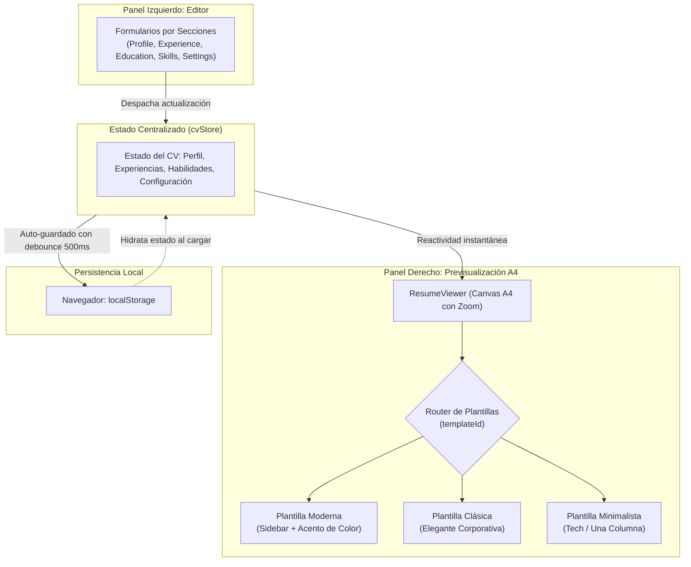

# Diseño Técnico y Arquitectura de Software

> **Documento SDD - Fase 2: Architecture & Technical Design**  
> **Estado:** 🟢 Aprobado por el Usuario  
> **Versión:** 1.0.0  
> **Fecha:** 2026-09-30  
> **Especificación Asociada:** [specs/01-specification.md](specs/01-specification.md)

---

## 1. Justificación y Selección del Stack Tecnológico

| Capa / Necesidad | Tecnología Seleccionada | Justificación Técnica |
| :--- | :--- | :--- |
| **Framework Core** | **Astro 5.x** | Genera una base estática ultra-ligera, tiempos de carga mínimos, óptimo rendimiento y soporte nativo de *Islands Architecture* (Islas de interactividad). |
| **Capa Reactiva (Editor/Preview)** | **React 19 / TypeScript** | Permite modelar componentes de formulario complejos, manejo de estado reactivo inmediato y tipado estricto sin retrasos de renderizado. Se monta como una isla de cliente (`client:load` / `client:only="react"`). |
| **Sistema de Estilos** | **Tailwind CSS v4** | Utilidades CSS atómicas para composición rápida de layouts, diseño responsivo y control preciso de reglas de impresión `@media print`. |
| **Persistencia Local** | **Web Storage API (`localStorage`)** | Persistencia local-first sin backend ni bases de datos remotas. Cero coste de hosting, privacidad garantizada y funcionamiento offline. |
| **Iconografía** | **Lucide Icons** (`lucide-react`) | Iconos vectoriales limpios, ligeros y de estilo moderno para datos de contacto (email, teléfono, linkedin, github, ubicación, etc.). |
| **Motor de Exportación PDF** | **Doble estrategia**: <br>1. `@media print` nativo (`window.print()`) <br>2. Captura directa a PDF (`html2pdf.js` / canvas) | El método nativo de impresión genera PDFs vectoriales de calidad de imprenta (texto seleccionable, enlaces activos, nitidez al 100%, 0 marcas de agua). El secundario permite descarga directa de archivo con un solo clic. |

---

## 2. Arquitectura del Sistema y Flujo de Datos

### Diagrama de Flujo de Datos Unidireccional:



---

## 3. Estructura de Directorios del Proyecto

> **Nota de Decisión Arquitectónica (ADR):** Los componentes de edición de formularios se agrupan bajo `src/components/ui/editor/` junto con los elementos atómicos de interfaz (`src/components/ui/`), consolidando las responsabilidades de UI y separándolas del motor de renderizado de plantillas (`src/components/preview/`) y del orquestador global (`CVApp.tsx`).

```
/home/jotace/Proyectos/Práctica SDD/
├── specs/                          # Artefactos vivos de SDD
│   ├── 01-specification.md         # Requisitos y Criterios de Aceptación (Aprobado)
│   ├── 02-architecture-design.md   # Diseño Técnico y Arquitectura (Este documento)
│   └── 03-tasks.md                 # Desglose de tareas atómicas para implementación
├── public/                         # Favicon, assets públicos
├── src/
│   ├── components/
│   │   ├── ui/                     # Interfaz de usuario y componentes de interacción
│   │   │   ├── Toolbar.tsx         # Barra superior: Descargar PDF, Rellenar ejemplo, Limpiar, Exportar/Importar JSON
│   │   │   └── editor/             # Componentes del formulario de entrada
│   │   │       ├── SectionCard.tsx     # Tarjeta contenedora de sección colapsable
│   │   │       ├── ProfileEditor.tsx   # Datos de contacto y resumen
│   │   │       ├── ExperienceEditor.tsx# Lista dinámica de experiencias
│   │   │       ├── EducationEditor.tsx # Lista dinámica de formación
│   │   │       ├── SkillsEditor.tsx    # Habilidades y nivel
│   │   │       ├── LanguagesEditor.tsx # Idiomas y competencia
│   │   │       └── SettingsEditor.tsx  # Color de acento, fuente y plantilla
│   │   ├── preview/                # Renderizado de la hoja A4
│   │   │   ├── ResumeViewer.tsx    # Contenedor escalable con controles de zoom
│   │   │   └── templates/          # Plantillas de CV desacopladas
│   │   │       ├── ModernTemplate.tsx
│   │   │       ├── ClassicTemplate.tsx
│   │   │       └── MinimalTemplate.tsx
│   │   └── CVApp.tsx               # Orquestador principal de la isla reactiva
│   ├── data/
│   │   ├── initialData.ts          # Estado vacío inicial
│   │   └── sampleData.ts           # Datos de muestra realistas para probar con un clic
│   ├── styles/
│   │   ├── design-tokens.css       # Tokens exportados desde DESIGN.md
│   │   ├── global.css              # Reset y directivas globales
│   │   └── print.css               # Reglas CSS específicas para @media print
│   ├── types/
│   │   └── cv.ts                   # Contratos de tipos TypeScript
│   ├── utils/
│   │   ├── storage.ts              # Utilidades de persistencia y serialización
│   │   └── pdf.ts                  # Métodos de impresión y exportación a PDF
│   └── pages/
│       └── index.astro             # Entrada de la webapp Astro (carga la isla CVApp)
├── astro.config.mjs
├── package.json
└── tsconfig.json
```

---

## 4. Contratos de Datos y Tipos Estrictos (`src/types/cv.ts`)

```typescript
export interface Profile {
  fullName: string;
  headline: string;
  email: string;
  phone: string;
  location: string;
  website: string;
  linkedin: string;
  github: string;
  summary: string;
  avatarUrl?: string;
}

export interface ExperienceItem {
  id: string;
  company: string;
  role: string;
  location: string;
  startDate: string;
  endDate: string;
  current: boolean;
  description: string;
}

export interface EducationItem {
  id: string;
  institution: string;
  degree: string;
  fieldOfStudy: string;
  startDate: string;
  endDate: string;
  description?: string;
}

export type SkillLevel = 'basic' | 'intermediate' | 'advanced';

export interface SkillItem {
  id: string;
  name: string;
  level: SkillLevel;
}

export interface LanguageItem {
  id: string;
  name: string;
  level: string; // ej: "Nativo", "C1 Avanzado", "B2 Intermedio"
}

export type TemplateId = 'modern' | 'classic' | 'minimal';
export type FontFamily = 'sans' | 'serif' | 'mono';

export interface CVSettings {
  templateId: TemplateId;
  accentColor: string; // Código Hexadecimal, ej: "#2563eb"
  fontFamily: FontFamily;
  showIcons: boolean;
}

export interface CVData {
  profile: Profile;
  experiences: ExperienceItem[];
  education: EducationItem[];
  skills: SkillItem[];
  languages: LanguageItem[];
  settings: CVSettings;
}

export interface TemplateProps {
  data: CVData;
}
```

---

## 5. Estrategia de Formateo e Impresión A4 (`Print Engine`)

Para garantizar que el PDF sea **exacto, vectorial y sin marcas de agua**:

1. **Dimensiones CSS en pantalla**:
   * La vista previa usa una caja con relación de aspecto A4:
     * Ancho base: `210mm` (o `794px` a 96 DPI)
     * Alto base: `297mm` (o `1123px` a 96 DPI)
   * Se añade una capa de escala transformable (`scale(zoom)`) para que se visualice cómodamente en pantallas pequeñas sin romper la maquetación.

2. **Reglas para `@media print`**:
   ```css
   @media print {
     @page {
       size: A4 portrait;
       margin: 0; /* Sin encabezados ni pies de página añadidos por el navegador */
     }
     
     body {
       margin: 0;
       background: white !important;
       -webkit-print-color-adjust: exact !important;
       print-color-adjust: exact !important;
     }

     /* Ocultar toda la interfaz del editor, barras y botones */
     .no-print, header, .editor-panel, .toolbar-container {
       display: none !important;
     }

     /* Expandir la hoja A4 exactamente al área imprimible */
     .a4-print-sheet {
       width: 210mm !important;
       min-height: 297mm !important;
       box-shadow: none !important;
       margin: 0 !important;
       transform: none !important;
       page-break-after: avoid;
     }
   }
   ```

---

## 6. Criterios de Aprobación de la Fase 2 (Gate 2)

Antes de pasar a la **Fase 3 (Desglose de Tareas / `tasks.md`)**:
1. ¿La arquitectura propuesta (Astro + React Island + Tailwind CSS + persistencia local) responde adecuadamente al objetivo?
2. ¿Los tipos y la estructura de componentes cubren de forma limpia los requisitos de la Fase 1?
3. ¿La solución de impresión A4 nativa cumple con la fidelidad vectorial y ausencia de marcas de agua?
