# Plan de Tareas de Implementación (Task Breakdown)

> **Documento SDD - Fase 3: Task Breakdown**  
> **Estado:** 🟡 En Revisión (Gate 3)  
> **Versión:** 1.0.0  
> **Fecha:** 2026-09-30  
> **Especificaciones Asociadas:** [01-specification.md](01-specification.md) | [02-architecture-design.md](02-architecture-design.md) | [DESIGN.md](../DESIGN.md)

---

## Metodología de Ejecución de Tareas en SDD

Cada tarea es atómica, verificable y trazable directamente a una Historia de Usuario (US) de la Fase 1 y a un componente del diseño técnico de la Fase 2.

```mermaid
gantt
    title Cronograma de Hitos SDD
    dateFormat  X
    axisFormat %s
    section Hito 1: Scaffolding y Estado
    Configuración Astro + React + Tailwind :0, 2
    Tipos TypeScript y Estado Inicial      :1, 3
    section Hito 2: Templates y Preview
    Contenedor A4 y Plantilla Moderna      :3, 5
    Plantillas Clásica y Minimalista       :5, 7
    section Hito 3: Formularios Editor
    Editor Perfil, Experiencia y Educación :7, 9
    Editor Skills, Idiomas y Settings      :9, 11
    section Hito 4: PDF e Impresión
    Print Engine A4 y Exportación JSON    :11, 13
    section Hito 5: Orquestación y QA
    Split-Screen e Integración en Astro   :13, 15
    Validación de Criterios de Aceptación :15, 17
```

---

## Hito 1: Scaffolding, Tipos Estrictos y Gestión de Estado

- [x] **TASK-1.1: Inicialización del Proyecto Astro y Tokens de Diseño**
  - **Descripción:** Crear e inicializar el proyecto en Astro 5 dentro de `/home/jotace/Proyectos/Práctica SDD/` integrando `@astrojs/react`, Tailwind CSS con los tokens exportados desde `DESIGN.md` (estándar Google Stitch), y paquetes esenciales (`lucide-react`, `clsx`, `tailwind-merge`).
  - **Criterio de Éxito:** El proyecto compila, `@google/design.md` valida con 0 errores y los tokens visuales están disponibles en la app.

- [x] **TASK-1.2: Definición de Tipos Estrictos (`src/types/cv.ts`)**
  - **Descripción:** Implementar las interfaces completas acordadas en Fase 2 (`Profile`, `ExperienceItem`, `EducationItem`, `SkillItem` con `SkillLevel = 'basic' | 'intermediate' | 'advanced'`, `LanguageItem`, `CVSettings`, `CVData`).
  - **Criterio de Éxito:** Archivo TypeScript sin errores de compilación `tsc`.

- [x] **TASK-1.3: Datos Iniciales y Muestra Realista (`src/data/`)**
  - **Descripción:** Crear `initialData.ts` (estado limpio vacío) y `sampleData.ts` (CV realista completo con experiencia de desarrollador de software para probar el renderizado de inmediato).
  - **Criterio de Éxito:** Las constantes satisfacen el tipo `CVData` sin advertencias de linter.

- [x] **TASK-1.4: Utilidad de Persistencia Local (`src/utils/storage.ts`)**
  - **Descripción:** Implementar funciones para leer/escribir en `localStorage` con clave `cv_wizard_data`, manejo de fallos y debounce de 500ms.
  - **Criterio de Éxito:** Los datos sobreviven a una recarga de página (`localStorage.getItem('cv_wizard_data')`).

---

## Hito 2: Motor de Previsualización y Plantillas A4 Desacopladas

- [x] **TASK-2.1: Contenedor de Hoja A4 con Zoom (`src/components/preview/ResumeViewer.tsx`)**
  - **Descripción:** Crear el visor de la hoja A4 con relación de aspecto estricta (`210mm x 297mm`), sombra realista de papel y barra inferior flotante de control de zoom (50%, 75%, 100%, Ajustar a pantalla).
  - **Criterio de Éxito:** La hoja A4 mantiene sus proporciones físicas al cambiar el tamaño de ventana o el nivel de zoom.

- [x] **TASK-2.2: Plantilla 1 - Moderna (`src/components/preview/templates/ModernTemplate.tsx`)**
  - **Descripción:** Crear plantilla contemporánea con barra lateral izquierda con color de acento personalizable para foto, contacto, habilidades (con badges según `basic`/`intermediate`/`advanced`) e idiomas; y columna principal para resumen, experiencia y educación.
  - **Criterio de Éxito:** Renderiza fidedignamente los datos de `sampleData.ts`.

- [x] **TASK-2.3: Plantilla 2 - Clásica Corporativa (`src/components/preview/templates/ClassicTemplate.tsx`)**
  - **Descripción:** Crear plantilla tradicional formal, encabezado centrado con líneas divisorias elegantes, tipografía serif/sans y estructura cronológica limpia.
  - **Criterio de Éxito:** Renderiza el mismo objeto `CVData` con estética ejecutiva formal.

- [x] **TASK-2.4: Plantilla 3 - Minimalista / Tech (`src/components/preview/templates/MinimalTemplate.tsx`)**
  - **Descripción:** Crear plantilla ultra-limpia de una columna, maximizando el espacio para perfiles técnicos, viñetas de proyectos y enlaces directos a GitHub/LinkedIn.
  - **Criterio de Éxito:** Renderiza el mismo objeto `CVData` con formato compacto y moderno.

---

## Hito 3: Formularios Modulares del Editor (UI Reactiva)

- [x] **TASK-3.1: Formulario de Perfil (`src/components/editor/ProfileEditor.tsx`)**
  - **Descripción:** Campos para nombre, titular profesional, email, teléfono, ciudad/país, sitio web, LinkedIn, GitHub y resumen profesional.
  - **Criterio de Éxito:** Al escribir cualquier letra, se refleja instantáneamente en la plantilla sin pérdida de foco.

- [x] **TASK-3.2: Formulario de Experiencia Laboral (`src/components/editor/ExperienceEditor.tsx`)**
  - **Descripción:** Lista dinámica con botones para "Añadir Puesto", campos para empresa, cargo, ubicación, fecha inicio, fecha fin, checkbox "Trabajo actual", descripción y botón para eliminar.
  - **Criterio de Éxito:** Permite agregar y borrar puestos dinámicamente.

- [x] **TASK-3.3: Formulario de Educación (`src/components/editor/EducationEditor.tsx`)**
  - **Descripción:** Lista dinámica para formación académica (institución, título, campo de estudio, fechas y descripción).
  - **Criterio de Éxito:** Soporta múltiples titulaciones con actualización reactiva.

- [x] **TASK-3.4: Formulario de Habilidades e Idiomas (`src/components/editor/SkillsEditor.tsx` & `LanguagesEditor.tsx`)**
  - **Descripción:** Lista de habilidades con selector de nivel (`basic`, `intermediate`, `advanced`) y lista de idiomas con nivel de fluidez.
  - **Criterio de Éxito:** Cumple estrictamente con el enum acordado en el diseño técnico.

- [x] **TASK-3.5: Personalización y Ajustes de Plantilla (`src/components/editor/SettingsEditor.tsx`)**
  - **Descripción:** Selector de plantilla (Moderna, Clásica, Minimalista), selector de color de acento interactivo y selector de familia tipográfica.
  - **Criterio de Éxito:** Cambia la plantilla activa y los colores de forma inmediata.

---

## Hito 4: Motor de Impresión y Exportación a PDF de Alta Fidelidad

- [x] **TASK-4.1: Estilos de Impresión A4 Vectorial (`src/styles/print.css`)**
  - **Descripción:** Configuración exhaustiva de `@page { size: A4 portrait; margin: 0; }` y reglas `@media print` para ocultar la interfaz web (formularios, cabeceras, botones) y renderizar exclusivamente la hoja A4 sin márgenes agregados por el navegador.
  - **Criterio de Éxito:** En el diálogo de impresión (`Ctrl + P`), sólo se previsualiza la hoja del CV sin cortes extraños ni elementos del editor.

- [x] **TASK-4.2: Barra de Herramientas y Acciones (`src/components/ui/Toolbar.tsx`)**
  - **Descripción:** Botones para:
    1. "Descargar PDF" (Dispara el diálogo de impresión optimizado A4).
    2. "Cargar Ejemplo" (Rellena con `sampleData`).
    3. "Limpiar Formulario" (Reinicia con confirmación).
    4. "Exportar JSON" y "Importar JSON" (Para respaldo y portabilidad total).
  - **Criterio de Éxito:** Todas las acciones funcionan según la especificación US-04 y US-05.

---

## Hito 5: Orquestación Final, Pruebas y Validación (Fase 5 SDD)

- [x] **TASK-5.1: Orquestador Principal (`src/components/CVApp.tsx` y `src/pages/index.astro`)**
  - **Descripción:** Integrar el split-screen responsivo (Editor a la izquierda, Preview a la derecha en pantallas grandes; pestañas en pantallas móviles) y montar la aplicación en la página principal de Astro.
  - **Criterio de Éxito:** La aplicación carga completa y navega fluidamente en el navegador.

- [x] **TASK-5.2: Matriz de Validación de Criterios de Aceptación**
  - **Descripción:** Verificar exhaustivamente cada criterio de aceptación de `specs/01-specification.md`:
    - [x] US-01: Formulario modular completo
    - [x] US-02: Previsualización reactiva con latencia cero
    - [x] US-03: Intercambio inmediato entre las 3 plantillas
    - [x] US-04: Descarga en PDF A4 vectorial sin marcas de agua
    - [x] US-05: Persistencia en `localStorage` y respaldo JSON
  - **Criterio de Éxito:** 100% de los criterios marcados como superados.
