# Plan de Tareas de Implementación v2.0: "CV Fácil"

> **Documento SDD - Fase 3: Task Breakdown**  
> **Estado:** 🟡 En Revisión (Gate 3)  
> **Versión:** 2.0.0  
> **Fecha:** 2026-10-02  
> **Especificaciones Vinculadas:** [04-especificacion-cv-facil-v2.md](04-especificacion-cv-facil-v2.md) | [05-arquitectura-cv-facil-v2.md](05-arquitectura-cv-facil-v2.md) | [05b-design-landing-lobby.md](05b-design-landing-lobby.md)  
> **Autor/Equipo:** CV Fácil Core Team & Jotace

---

## Metodología y Reglas de Ejecución

Cada tarea es atómica, desacoplada y trazable a las Historias de Usuario (`US-06` a `US-10`). No se escribe código de producción sin haber alcanzado la aprobación de **Gate 3**. Cada tarea exige comentarios TSDoc/JSDoc en el código para asegurar la mantenibilidad a largo plazo.

```mermaid
gantt
    title Cronograma de Implementación v2.0
    dateFormat  X
    axisFormat %s
    section Hito 1: Primitivas y Layout
    Layout, Footer unificado y ThemeToggle :0, 2
    Componentes Primitivos (Button, Modal, Card) :1, 3
    section Hito 2: Almacenamiento Seguro
    IStorageAdapter y LocalStorageAdapter   :3, 5
    GoogleDriveAdapter y Sanitizador de URLs :4, 6
    section Hito 3: Landing Page
    HeroSection, Features y Donaciones     :6, 8
    section Hito 4: Lobby (ONLYOFFICE)
    Acciones Rápidas y Tabla de Recientes  :8, 10
    Modales de Gestión de Documentos       :9, 11
    section Hito 5: Editor y Exportación
    FloatingStyleDock y Foto de Perfil     :11, 13
    Modal de Exportación con Límite < 2MB  :12, 14
    section Hito 6: QA y Trazabilidad
    Validación de Criterios Given-When-Then:14, 16
```

---

## Hito 1: Shell Base, Modo Oscuro y Primitivas Abstractas Reutilizables

- [ ] **TASK-2.1.1: Layout Base y Soporte Nativo de Modo Oscuro**
  - **Archivos:** `src/components/common/layout/BaseLayout.astro`, `src/utils/theme.ts`
  - **Trazabilidad:** `US-10`
  - **Descripción:** Crear el layout común en Astro con detección inicial de tema (claro/oscuro) sin parpadeo (*flash of unstyled content*), carga de fuentes y persistencia en `localStorage.getItem('cv_facil_theme')`.
  - **Definition of Done (DoD):** Al hacer clic en el switch de tema, la clase `dark` conmuta en `<html>` y la preferencia sobrevive a la recarga de página. Comentado con TSDoc.

- [ ] **TASK-2.1.2: Componente Unificado de Donaciones y Pie de Página (`UnifiedFooter.astro`)**
  - **Archivos:** `src/components/common/layout/UnifiedFooter.astro`
  - **Trazabilidad:** `US-06` (Criterio 6.2 y 6.3)
  - **Descripción:** Implementar el pie de página común reutilizable en Landing, Lobby y Editor, incluyendo enlaces directos a Buy Me a Coffee, PayPal, Prex, Mercado Pago y repositorio de GitHub.
  - **Definition of Done (DoD):** Componente estático de Astro importable en cualquier página, con enlaces válidos y diseño adaptativo claro/oscuro.

- [ ] **TASK-2.1.3: Barra de Navegación Común (`Navbar.astro`)**
  - **Archivos:** `src/components/common/layout/Navbar.astro`, `src/components/common/layout/ThemeToggle.tsx`
  - **Trazabilidad:** `US-06`, `US-10`
  - **Descripción:** Barra superior con isotipo "CV Fácil", badge "Open Source", botón interactivo de tema e indicador/botón de estado de Google Drive.
  - **Definition of Done (DoD):** Renderiza correctamente en móviles y computadoras de escritorio.

- [ ] **TASK-2.1.4: Catálogo de Primitivas Reutilizables (`ActionCard`, `Modal`, `Button`)**
  - **Archivos:** `src/components/common/primitives/ActionCard.tsx`, `Modal.tsx`, `Button.tsx`
  - **Trazabilidad:** `US-06`, `US-07`, `US-09`
  - **Descripción:** Crear componentes abstractos con TypeScript estricto, focus-trap accesible (WCAG) en modales, y variantes semánticas.
  - **Definition of Done (DoD):** Componentes documentados con ejemplos de uso en TSDoc, libres de errores de TypeScript.

- [ ] **TASK-2.1.5: Metadatos SEO, Open Graph y Schema.org para Mercado Hispanohablante**
  - **Archivos:** `src/components/common/layout/SEO.astro`, `public/robots.txt`, `src/pages/index.astro`
  - **Trazabilidad:** Especificación 05 (Sección 6)
  - **Descripción:** Componente SEO en Astro con etiquetas meta optimizadas para intención de búsqueda en español ("crear curriculum vitae gratis", "hacer cv online pdf"), Open Graph, Twitter Cards, `hreflang="es"`, y Schema.org `WebApplication` en JSON-LD.
  - **Definition of Done (DoD):** Metatags y datos estructurados validados con Google Rich Results Test (0 errores), Lighthouse SEO = 100.

---

## Hito 2: Capa de Persistencia, Seguridad y Adaptador de Google Drive

- [ ] **TASK-2.2.1: Interfaz y Modelo de Dominio (`IStorageAdapter.ts`)**
  - **Archivos:** `src/services/storage/IStorageAdapter.ts`, `src/types/storage.ts`
  - **Trazabilidad:** `US-08`
  - **Descripción:** Definir formalmente las interfaces `IStorageAdapter` y `CVMetadata` con comentarios exhaustivos sobre cada método.
  - **Definition of Done (DoD):** Tipos inmutables compilando sin errores en `tsc`.

- [ ] **TASK-2.2.2: Implementación de Modo Invitado (`LocalStorageAdapter.ts`)**
  - **Archivos:** `src/services/storage/LocalStorageAdapter.ts`
  - **Trazabilidad:** `US-08` (Criterio 8.1)
  - **Descripción:** Implementar las operaciones CRUD completas en el almacenamiento local bajo la clave `cv_facil_library`.
  - **Definition of Done (DoD):** Pruebas de guardado, duplicación, renombrado y borrado exitosas en consola/navegador.

- [ ] **TASK-2.2.3: Adaptador de Google Drive y Sanitización de URLs**
  - **Archivos:** `src/services/storage/GoogleDriveAdapter.ts`, `src/utils/security.ts`
  - **Trazabilidad:** `US-08` (Criterio 8.2 y 8.3)
  - **Descripción:** Integrar cliente Google OAuth2 con alcance `drive.file`. Crear carpeta `CV Fácil/` y funciones para sincronizar el par `.json` / `.pdf`. Implementar función `sanitizeDocumentId` con regex estricta contra inyecciones.
  - **Definition of Done (DoD):** Ningún parámetro malicioso puede inyectarse en `/editor?id=...`; las operaciones de Drive persisten en la carpeta del usuario.

- [ ] **TASK-2.2.4: Hardening de Seguridad del Stack (XSS, CSP, Magic Bytes, Token Volatilidad)**
  - **Archivos:** `src/utils/security.ts`, `src/components/common/layout/BaseLayout.astro`
  - **Trazabilidad:** Especificación 05 (Sección 7)
  - **Descripción:** Implementar funciones `sanitizeExternalUrl` (bloqueo de `javascript:` y `data:`), validación de fotos de perfil (magic bytes para evitar SVG maliciosos), política CSP restrictiva, y almacenamiento estrictamente volátil/en memoria para tokens de Google.
  - **Definition of Done (DoD):** Cada función de mitigación contiene comentarios `// SECURITY (CWE-79 / CWE-94)` explicando el vector y la protección aplicada. Pruebas de inyección neutralizadas.

---

## Hito 3: Landing Page Pública (`src/pages/index.astro`)

- [ ] **TASK-2.3.1: Hero Section con Efectos Sutiles y CTAs**
  - **Archivos:** `src/components/landing/HeroSection.astro`, `src/pages/index.astro`
  - **Trazabilidad:** `US-06`, `US-10`
  - **Descripción:** Maquetar la pantalla de bienvenida con gradiente sutil (*mesh gradient*), titular de impacto y botón constante "Comenzar ahora (Gratis)".
  - **Definition of Done (DoD):** Lighthouse Score de accesibilidad y rendimiento $\ge 95$.

- [ ] **TASK-2.3.2: Cuadrícula de Características y Bloque de Donaciones**
  - **Archivos:** `src/components/landing/FeaturesGrid.astro`, `DonationBanner.astro`
  - **Trazabilidad:** `US-06` (Criterio 6.1 y 6.2)
  - **Descripción:** Integrar las 4 tarjetas de diferenciadores usando `ActionCard` y el bloque de donaciones transparentes.
  - **Definition of Done (DoD):** Visualmente armónico en tema claro y oscuro, con enlaces funcionales.

---

## Hito 4: Lobby de Gestión de CVs (`src/pages/lobby.astro`)

- [ ] **TASK-2.4.1: Barra de Acciones Rápidas (ONLYOFFICE-Style)**
  - **Archivos:** `src/components/lobby/QuickActionsBar.tsx`, `src/pages/lobby.astro`
  - **Trazabilidad:** `US-07` (Criterio 7.1)
  - **Descripción:** Fila superior con 3 tarjetas interactivas: "Crear en blanco", "Elegir plantilla" e "Importar JSON/PDF".
  - **Definition of Done (DoD):** Al hacer clic en "Crear en blanco", genera un nuevo ID seguro y redirige al editor.

- [ ] **TASK-2.4.2: Tabla de Documentos Recientes con Menú Contextual**
  - **Archivos:** `src/components/lobby/RecentDocumentsTable.tsx`, `DocumentRowMenu.tsx`
  - **Trazabilidad:** `US-07` (Criterio 7.2)
  - **Descripción:** Listado de CVs del usuario con columnas de estado, destino (Local / Drive) y menú desplegable para abrir, renombrar, duplicar, descargar PDF y eliminar.
  - **Definition of Done (DoD):** Cada acción actualiza el estado reactivo inmediatamente con diálogos de confirmación accesibles (`Modal.tsx`).

---

## Hito 5: Editor Refinado y Diálogo de Exportación (`src/pages/editor.astro`)

- [ ] **TASK-2.5.1: Menú Flotante de Estilos (`FloatingStyleDock.tsx`) y Soporte de Foto**
  - **Archivos:** `src/components/editor/FloatingStyleDock.tsx`, `src/types/cv.ts`
  - **Trazabilidad:** `US-01` (v1.0 extendida) y Especificación 05b
  - **Descripción:** Reubicar la selección de plantilla, color y fuente a un botón flotante en la esquina inferior derecha. Agregar soporte para cargar foto de perfil (base64 comprimido).
  - **Definition of Done (DoD):** El dock flota sin obstruir la vista previa; cambiar plantilla o color actualiza en tiempo real.

- [ ] **TASK-2.5.2: Diálogo de Exportación con Control de Peso (< 2MB) y Destinos**
  - **Archivos:** `src/components/editor/ExportModal.tsx`, `src/utils/pdfExport.ts`
  - **Trazabilidad:** `US-09` (Criterios 9.1 a 9.4)
  - **Descripción:** Modal que sustituye la impresión directa del navegador. Permite seleccionar perfiles de compresión para asegurar $< 2\text{MB}$ y elegir entre "Descargar en este equipo" o "Guardar en Google Drive".
  - **Definition of Done (DoD):** Genera el archivo PDF con compresión verificable y sincroniza con `IStorageAdapter`.

---

## Hito 6: Validación de Criterios (Fase 5 SDD) y Matriz de Trazabilidad (RTM)

- [ ] **TASK-2.6.1: Validación de Criterios Given-When-Then**
  - **Trazabilidad:** Cobertura 100% de `US-06` a `US-10`.
  - **Definition of Done (DoD):** Verificación manual y automatizada de cada criterio documentada formalmente.

---

## Compuerta de Aprobación (GATE 3)

> **GATE 3 STATUS:** 🟡 Pendiente de Aprobación del Usuario  
> Una vez validado este plan de tareas con DoD, se autoriza formalmente el inicio de la Fase 4: Implementación Disciplinada.
