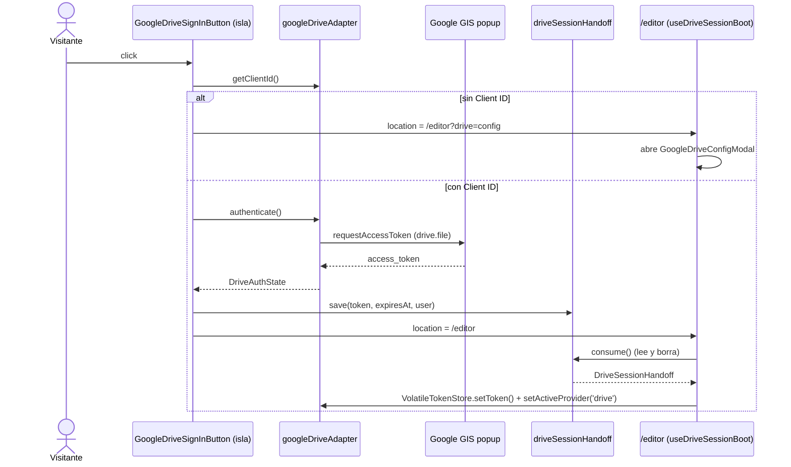

# Especificación, Arquitectura y Tareas: Rediseño de la Landing Page (v2.2.0)

> **Documento SDD - Fases 1, 2, 2B y 3 (Delta Spec)**  
> **Estado:** 🟢 Aprobado por el Usuario (Gates 1, 2 y 3 validados)  
> **Versión:** 2.2.0  
> **Fecha:** 2026-10-04  
> **Construye sobre:** [04-especificacion-cv-facil-v2.md](04-especificacion-cv-facil-v2.md) (US-06, US-08, US-10) | [05b-design-landing-lobby.md](05b-design-landing-lobby.md) | [07-refactor-legibilidad.md](07-refactor-legibilidad.md)  
> **Fuente de intención:** [`CV-Facil-Landing-Page-Redesign-Concept.excalidraw`](../CV-Facil-Landing-Page-Redesign-Concept.excalidraw)  
> **Autor/Equipo:** jotacé & Antigravity

---

## 0. Changelog sobre el Baseline

| Criterio baseline | Estado | Reemplazado por |
|---|---|---|
| US-06 · Criterio 6.1 (CTA "Comenzar" constante) | 🔁 Reemplazado en la landing | US-11 (CTA "Creá tu CV") · US-13 · US-17 |
| US-06 · Criterio 6.2 (Donaciones: BMC, PayPal, Prex, MP) | 🔁 Reemplazado en la landing | US-15 (Cafecito) · US-18 (Cafecito + PayPal) |
| US-06 · Criterio 6.3 (Footer unificado en todo el sitio) | ✂️ Acotado a Lobby y Editor | US-18 (`LandingFooter` exclusivo de `/`) |
| US-07 · Criterio 7.3 (Redirección automática al Lobby) | ⏸️ Sin cambios (sigue suprimido) | — |

> Los criterios reemplazados **no se reescriben** en `04` (Baseline cerrado, ver `lessons/01`). En `04` solo se agrega una nota de revisión que apunta a este documento.

---

# PARTE I — Especificación Funcional (Fase 1)

## 1. Visión del Rediseño

La landing pasa de un tono "corporativo neutro" con métricas de prueba social inventadas a una propuesta **honesta, directa y en español rioplatense (voseo)**: qué es CV Fácil, cómo se usa en tres pasos, qué lo diferencia, quién lo hace y cómo apoyarlo. Cada sección termina en una acción concreta: crear el CV, donar, contratar al autor o darle una estrella al repositorio.

**Arquitectura de información (orden vertical de `/`):**

```
LandingNavbar → HeroSection → HowItWorks → FeaturesGrid → AboutTheProject → StartNow → LandingFooter
```

---

## 2. Historias de Usuario y Criterios de Aceptación

### US-11: Barra de navegación exclusiva de la landing
**Como** visitante de la landing,  
**quiero** una barra superior mínima con la marca, el acceso a plantillas, el tema, el inicio de sesión y el CTA principal,  
**para** orientarme y empezar sin distracciones.

* **Criterio 11.1 (Composición):**
  * *Dado* un visitante en `/`,
  * *Cuando* se renderiza la barra superior,
  * *Entonces* ve, de izquierda a derecha: **[Marca CV Fácil] [Botón GitHub]** · **"Plantillas" (centrado)** · **[ThemeToggle] [Botón Google Drive] [Creá tu CV]**, y **no** ve los enlaces "Inicio", "Mis CVs (Lobby)" ni "Editor", ni el badge "ATS Ready & Local-First".
* **Criterio 11.2 (CTA principal):**
  * *Dado* el botón "Creá tu CV",
  * *Cuando* el visitante lo pulsa,
  * *Entonces* navega a `/editor`.
* **Criterio 11.3 (Micro-interacción GitHub):**
  * *Dado* el botón de GitHub junto a la marca,
  * *Cuando* el visitante posa el cursor o enfoca el botón con teclado,
  * *Entonces* el logo de GitHub ejecuta una animación sutil (un "saludo" del logo con una estrella que aparece), y con `prefers-reduced-motion: reduce` no hay animación.
* **Criterio 11.4 (Aislamiento):**
  * *Dado* `/lobby` y `/editor`,
  * *Cuando* se renderizan tras este ciclo,
  * *Entonces* siguen usando el `Navbar` actual sin cambios visuales.

### US-12: Acceso con Google desde la landing (flujo mínimo)
**Como** visitante que quiere guardar sus CVs en su Drive,  
**quiero** iniciar sesión con Google desde la landing,  
**para** llegar al editor ya conectado.

* **Criterio 12.1 (Botón):**
  * *Dado* la barra de navegación,
  * *Cuando* se renderiza el botón de acceso,
  * *Entonces* muestra el **logo oficial de Google Drive en sus colores originales** y el texto de acceso (ver Pregunta Abierta Q3).
* **Criterio 12.2 (Popup y redirección):**
  * *Dado* un Client ID de Google disponible,
  * *Cuando* el visitante pulsa el botón,
  * *Entonces* se abre el popup de Google Sign-In (GIS, alcance `drive.file`) y, tras el consentimiento, el sistema lo redirige a **`/editor`** con Google Drive como proveedor activo.
* **Criterio 12.3 (Cancelación o error):**
  * *Dado* el popup abierto,
  * *Cuando* el visitante lo cierra o Google devuelve un error,
  * *Entonces* permanece en la landing y ve un mensaje no bloqueante; no hay redirección.
* **Criterio 12.4 (Sin Client ID):**
  * *Dado* que el build no tiene `PUBLIC_GOOGLE_CLIENT_ID` ni hay un Client ID guardado,
  * *Cuando* el visitante pulsa el botón,
  * *Entonces* se lo redirige a `/editor?drive=config`, donde se abre el modal existente de configuración de Drive.
* **Criterio 12.5 (Seguridad):**
  * *Dado* el traspaso de sesión landing → editor,
  * *Cuando* se completa la redirección,
  * *Entonces* el token **no** queda persistido en `localStorage` ni en cookies, y cualquier traspaso temporal se elimina en el primer arranque del editor (ver Pregunta Abierta Q1).

### US-13: Hero
**Como** visitante,  
**quiero** entender en un vistazo qué es CV Fácil y ver ejemplos del resultado,  
**para** decidir empezar.

* **Criterio 13.1:** *Dado* el hero, *Cuando* se renderiza, *Entonces* muestra el `<h1>` **"CV Fácil — Creá tu currículum fácil, rápido, gratis."**, un botón **"Ir al editor"** (→ `/editor`) y, a la derecha (debajo en mobile), el `HeroBanner` con tres ejemplos de CV terminados.
* **Criterio 13.2:** *Dado* el hero, *Cuando* se renderiza, *Entonces* **no** contiene badges, avatares, calificaciones, métricas de "+15.000 profesionales" ni tarjetas flotantes.
* **Criterio 13.3:** *Dado* que la imagen definitiva aún no existe, *Cuando* se renderiza, *Entonces* se muestra un placeholder con la misma relación de aspecto, servido con `<Image>` de Astro y con `alt` descriptivo.

### US-14: Cómo funciona (reemplaza `CompetitiveAdvantage`)
* **Criterio 14.1:** *Dado* la sección, *Cuando* se renderiza, *Entonces* muestra tres tarjetas en orden, cada una con un ícono `lucide-react`:
  1. `ClipboardList` · **Llená el formulario**
  2. `Palette` · **Diseñá a tu gusto**
  3. `Download` · **Descargá tu CV** (con badge **"Próximamente"** junto a DOCX)
* **Criterio 14.2:** *Dado* la demo bajo las tarjetas, *Cuando* el visitante llega a la sección, *Entonces* ve una secuencia animada de capturas (fundido cruzado CSS) que recorre los tres pasos; con `prefers-reduced-motion` ve solo la primera captura de forma estática.
* **Criterio 14.3:** *Dado* que las capturas definitivas aún no existen, *Cuando* se renderiza, *Entonces* se usan frames de reemplazo con la misma relación de aspecto.

### US-15: Características (rediseño de `FeaturesGrid`)
* **Criterio 15.1:** *Dado* la sección, *Cuando* se renderiza, *Entonces* muestra un **bento de 5 tarjetas** con el texto aprobado (§6.3), en voseo.
* **Criterio 15.2 (Formatos honestos):** *Dado* la tarjeta de formatos, *Cuando* se renderiza, *Entonces* PDF y JSON aparecen como disponibles y **DOCX y Markdown con badge "Próximamente"**.
* **Criterio 15.3 (CTA persiana):** *Dado* la tarjeta "Gratis. Para siempre.", *Cuando* pasan 3 s, *Entonces* el CTA visible se intercambia con un efecto de persiana hacia abajo entre **"Invitame un cafecito"** (→ Cafecito) y **"¿Necesitás una web? Contactame."** (→ `mailto`), en loop infinito.
* **Criterio 15.4 (Pausa):** *Dado* el CTA persiana, *Cuando* el visitante lo apunta con el cursor o enfoca alguno de sus botones, *Entonces* la rotación se pausa y ambos botones quedan accesibles por teclado.
* **Criterio 15.5 (Movimiento reducido):** *Dado* `prefers-reduced-motion: reduce`, *Cuando* se renderiza, *Entonces* ambos botones se muestran estáticos, uno al lado del otro.

### US-16: Sobre el proyecto (reemplaza `SuccessStories`)
* **Criterio 16.1:** *Dado* la sección, *Cuando* se renderiza, *Entonces* muestra cuatro desplegables nativos (`<details>`): **¿Cómo nació?**, **¿Qué problema resuelve?**, **¿Cómo está pensada la solución?**, **¿Cómo contribuir?**, con el texto que escribe jotacé (placeholder hasta entonces).
* **Criterio 16.2:** *Dado* la sección, *Cuando* el visitante pulsa el botón con logo de GitHub, *Entonces* se abre `https://github.com/noctambuho/cv-facil` en otra pestaña (`rel="noopener noreferrer"`), sin contador de estrellas.
* **Criterio 16.3:** *Dado* la sección, *Cuando* pulsa **"Contacto"**, *Entonces* se abre su cliente de correo con el `mailto` de contacto (§5.4).

### US-17: Empezá ahora (`StartNow`, nuevo)
* **Criterio 17.1:** *Dado* la sección, *Cuando* se renderiza, *Entonces* muestra **"Destacá con tu CV. Dejá de ser descartado por un bot."**, una ilustración generada según la identidad de marca y el botón **"Creá tu CV"** (→ `/editor`).
* **Criterio 17.2:** *Dado* `/lobby` y `/editor`, *Cuando* se renderizan, *Entonces* **no** incluyen `StartNow`.

### US-18: Footer exclusivo de la landing (`LandingFooter`)
* **Criterio 18.1:** *Dado* `/`, *Cuando* el visitante baja al pie, *Entonces* ve: marca + tagline, enlaces a GitHub, Contacto (`mailto`), **Cafecito** y **PayPal (con logo)**, un **placeholder de "Mapa del sitio"**, la licencia, **"Creado en Uruguay por jotacé"** y © del año en curso.
* **Criterio 18.2:** *Dado* `/lobby` y `/editor`, *Cuando* se renderizan, *Entonces* siguen usando `UnifiedFooter`.

### US-19: Exploración de identidad (logo)
* **Criterio 19.1:** *Dado* el proyecto de Stitch "CV Fácil — Identidad", *Cuando* se ejecuta la exploración, *Entonces* jotacé recibe **5 opciones distintas** de isotipo + wordmark para evaluar.
* **Criterio 19.2:** *Dado* que todavía no hay un logo elegido, *Cuando* se renderiza la marca, *Entonces* `BrandLogo` muestra el isotipo actual (`FileText` sobre gradiente) + el wordmark "CV Fácil". El cambio de logo queda para un ciclo posterior.

---

## 3. Delimitación de Fronteras

### En Alcance
- Reestructuración de `src/components/common/layout/` y de `src/components/landing/`.
- `LandingNavbar`, `LandingFooter`, `BrandLogo`, `GitHubMark`, botón de Google Drive con flujo mínimo popup → `/editor`.
- Stubs vacíos de `LobbyNavbar` y `EditorNavbar` (sin uso todavía).
- Secciones `HeroSection` (reescrita), `HowItWorks`, `FeaturesGrid` (reescrita), `AboutTheProject`, `StartNow`.
- Eliminación de `CompetitiveAdvantage`, `SuccessStories` y `DonationBanner`.
- Metadatos SEO de `/` en voseo.
- Prompt del HeroBanner, ilustración de StartNow y 5 opciones de logo (Stitch).

### Fuera de Alcance
- Imagen definitiva del HeroBanner, capturas de la demo y narrativa de "Sobre el proyecto" (las aporta jotacé).
- Aplicar el logo elegido (ciclo posterior).
- Contenido real de `LobbyNavbar` y `EditorNavbar`, y eliminar el `Navbar` actual.
- Exportación DOCX/Markdown (solo se anuncia como "Próximamente").
- Cerrar sesión desde la landing, y avatar/nombre del usuario en la landing.
- Contenido del mapa del sitio (solo placeholder).
- Cambiar `lang="es"`.

---

# PARTE II — Arquitectura y Diseño Técnico (Fase 2)

## 4. Estructura de Directorios Objetivo

```
src/
├── types/
│   └── landing.ts                    # [CONTRATO] NUEVO
├── data/
│   ├── landing.ts                    # [CONSTANTE] NUEVO · copy de secciones
│   └── siteLinks.ts                  # [CONSTANTE] NUEVO · URLs externas y contacto
├── domain/
│   └── mailto.ts                     # [PURA] NUEVO · buildMailtoHref()
├── services/storage/
│   └── driveSessionHandoff.ts        # [EFECTO] NUEVO · traspaso landing → editor (Q1)
├── assets/landing/                   # NUEVO · imágenes optimizadas por <Image>
│   ├── hero-banner-placeholder.svg
│   ├── demo-step-{1,2,3}-placeholder.svg
│   └── start-now.png                 # generada
└── components/
    ├── common/layout/
    │   ├── BaseLayout.astro          # sin cambios
    │   ├── SEO.astro                 # + prop opcional featureList
    │   ├── ThemeToggle.tsx           # sin cambios
    │   ├── brand/
    │   │   ├── BrandLogo.astro       # NUEVO · único punto de cambio del logo
    │   │   └── GitHubMark.astro      # NUEVO · SVG + animación hover
    │   ├── navbar/
    │   │   ├── Navbar.astro          # MOVIDO · @deprecated (lobby/editor)
    │   │   ├── LandingNavbar.astro   # NUEVO
    │   │   ├── LobbyNavbar.astro     # NUEVO · stub vacío
    │   │   ├── EditorNavbar.astro    # NUEVO · stub vacío
    │   │   └── GoogleDriveSignInButton.tsx  # NUEVO · [ISLA]
    │   └── footer/
    │       ├── UnifiedFooter.astro   # MOVIDO · lobby/editor
    │       └── LandingFooter.astro   # NUEVO
    ├── editor/hooks/
    │   └── useDriveSessionBoot.ts    # NUEVO · [HOOK] consume el traspaso y ?drive=config
    └── landing/
        ├── HeroSection.astro         # REESCRITO
        ├── HowItWorks.astro          # NUEVO
        ├── FeaturesGrid.astro        # REESCRITO
        ├── AboutTheProject.astro     # NUEVO
        ├── StartNow.astro            # NUEVO
        ├── parts/
        │   ├── DemoSequence.astro    # NUEVO · crossfade CSS
        │   ├── RotatingCta.astro     # NUEVO · persiana CSS
        │   └── ComingSoonBadge.astro # NUEVO
        ├── CompetitiveAdvantage.astro  # ELIMINADO
        ├── SuccessStories.astro        # ELIMINADO
        └── DonationBanner.astro        # ELIMINADO
tests/domain/
└── mailto.test.ts                    # NUEVO
```

**Decisiones:**
1. **Chrome por página dentro de `common/layout/`** (subcarpetas `navbar/`, `footer/`, `brand/`): concentra toda la "cáscara" del sitio en un lugar y prepara el reemplazo de `Navbar` por `LobbyNavbar`/`EditorNavbar`.
2. **Copy fuera de los componentes** (`src/data/landing.ts`): las secciones quedan declarativas (≤ 200 líneas) y editar textos no toca markup.
3. **Animaciones solo con CSS** (persiana, crossfade, GitHub): cero JS y cero dependencias; se pausan con `:hover`/`:focus-within` y respetan `prefers-reduced-motion`.
4. **Una única isla React nueva** (`GoogleDriveSignInButton`, `client:idle`); el resto de la landing es HTML estático.

## 5. Contratos de Tipos (`src/types/landing.ts`)

```ts
/** [CONTRATO] Enlace externo seguro (siempre target=_blank + rel="noopener noreferrer"). */
export interface ExternalLink {
  label: string;
  href: string;
  ariaLabel?: string;
}

/** [CONTRATO] Parámetros de un enlace mailto. */
export interface MailtoParams {
  to: string;
  subject?: string;
  body?: string;
}

/** [CONTRATO] Paso de la sección "Cómo funciona". */
export interface HowItWorksStep {
  id: 'fill' | 'design' | 'download';
  icon: 'ClipboardList' | 'Palette' | 'Download';
  title: string;
  description: string;
  comingSoon?: string[]; // ej. ['DOCX']
}

/** [CONTRATO] Frame de la demo animada. */
export interface DemoFrame {
  stepId: HowItWorksStep['id'];
  alt: string;
}

/** [CONTRATO] Etiqueta de formato con disponibilidad. */
export interface FormatBadge {
  label: 'PDF' | 'JSON' | 'DOCX' | 'Markdown';
  comingSoon: boolean;
}

/** [CONTRATO] Tarjeta del bento de características. */
export interface FeatureCard {
  id: 'ats' | 'drive' | 'privacy' | 'formats' | 'free';
  title: string;
  description: string;
  layout: 'wide' | 'narrow' | 'half' | 'full';
  formats?: FormatBadge[];
  withRotatingCta?: boolean;
}

/** [CONTRATO] Desplegable de "Sobre el proyecto". body = null → placeholder pendiente. */
export interface AboutItem {
  id: 'origin' | 'problem' | 'solution' | 'contribute';
  summary: string;
  body: string | null;
}

/** [CONTRATO] Traspaso efímero de sesión de Drive entre la landing y el editor (Q1). */
export interface DriveSessionHandoff {
  accessToken: string;
  expiresAt: number; // epoch ms
  user: { email: string; name: string };
}
```

### 5.4 Constantes de enlaces (`src/data/siteLinks.ts`)

| Constante | Valor |
|---|---|
| `GITHUB_REPO_URL` | `https://github.com/noctambuho/cv-facil` |
| `CONTACT_EMAIL` | `jcnunezgrandal@gmail.com` |
| `CONTACT_MAILTO` | `buildMailtoHref({ to, subject: '[IMPORTANTE] Quiero un sitio web' })` (Q6) |
| `CAFECITO_URL` | ⚠️ pendiente (Q5) |
| `PAYPAL_URL` | ⚠️ pendiente (Q5) |

## 6. Flujo de Datos: Acceso con Google (US-12)



> **Restricción detectada:** hoy el token vive **solo en memoria** (`VolatileTokenStore`, CWE-922). Una navegación completa `/` → `/editor` lo pierde. El traspaso efímero en `sessionStorage` (escritura justo antes de redirigir, lectura y borrado inmediato en el editor, con TTL ≤ 60 s) es la propuesta recomendada y **requiere enmendar** el invariante de seguridad de `driveTokenStore.ts` (ver Q1).

## 7. Diseño Visual de Secciones (Fase 2B)

### 7.1 LandingNavbar
- `sticky top-0`, `backdrop-blur`, altura `h-14 sm:h-16`, grid de 3 columnas (`grid-cols-[1fr_auto_1fr]`) para que "Plantillas" quede realmente centrado.
- En mobile: "Plantillas" se oculta (`sm:` en adelante), el botón de Drive queda solo con ícono y "Creá tu CV" siempre visible.
- **GitHubMark hover:** keyframe `wave` (rotate −12° → 10° → −6° → 0°, 600 ms) + una estrella `✦` que sube y se desvanece desde la esquina superior derecha; se dispara con `:hover` y `:focus-visible`.

### 7.2 HeroSection
- Dos columnas (`lg:flex-row`). Izquierda: `<h1>` en `serif-title`, con "fácil, rápido, gratis." en el gradiente de marca indigo → blue → violet, y el CTA "Ir al editor". Derecha: `<Image>` del HeroBanner con `loading="eager"` y `fetchpriority="high"` (candidato a LCP).

### 7.3 Copy aprobado para revisión (voseo pulido)

**HowItWorks** — Título: *"Tres pasos. Sin vueltas."*
1. **Llená el formulario** — "Completá tus datos en un formulario guiado: experiencia, estudios, habilidades e idiomas."
2. **Diseñá a tu gusto** — "Elegí una plantilla prediseñada y hacela tuya: el color que mejor te represente, la fuente que transmita tu personalidad y la estructura que resalte lo que querés mostrar de vos."
3. **Descargá tu CV** — "Bajalo en PDF, guardalo en tu Google Drive o exportalo en JSON. DOCX `Próximamente`."

**FeaturesGrid** — Título: *"Hecho para que te llamen"*

| # | Layout | Título | Descripción |
|---|---|---|---|
| 1 | wide (4/6) | **Que no te descarte un robot** | "No pierdas más oportunidades por culpa de las automatizaciones. Tu CV se arma con una estructura optimizada para la lectura de los filtros ATS, para que el recruiter vuelva a tener la chance de conocerte." |
| 2 | narrow (2/6) | **Tus CVs, siempre a mano** | "Iniciá sesión con tu cuenta de Google, sincronizá tus CVs en tu Drive y tené acceso a ellos desde donde estés." |
| 3 | half (3/6) | **Tus datos son tuyos** | "¿Preferís usar solo el editor y descargar tu archivo? No hay drama. Nada viaja a ningún servidor: todo queda en tu navegador." |
| 4 | half (3/6) | **El formato que necesites** | "Elegí el que quieras o el que más conozcas." · Badges: `PDF` `JSON` `DOCX · Próximamente` `Markdown · Próximamente` |
| 5 | full (6/6) | **Gratis. Para siempre.** | "Y lo más importante: no pagás nada. Este proyecto crece solo con tus donaciones." + `RotatingCta` |

**StartNow** — "Destacá con tu CV. Dejá de ser descartado por un bot." · CTA "Creá tu CV".

**SEO `/`** — Title: *"CV Fácil — Creá tu currículum gratis, fácil y rápido (PDF A4, sin marcas de agua)"* · Description: *"Armá tu CV online en minutos: elegí una plantilla, personalizala y descargalo en PDF. Gratis para siempre, sin registro y con tus datos en tu navegador o en tu Google Drive."*

### 7.4 RotatingCta (persiana)
- Contenedor con `overflow: clip` y altura fija; las dos caras se apilan en la misma celda de grid. Un keyframe de 6 s (3 s por cara) anima `clip-path: inset()` de arriba hacia abajo para simular una persiana que baja.
- `:hover` y `:focus-within` → `animation-play-state: paused`. En `:focus-within` además se pasa a un layout estático con ambas caras visibles, para que nunca quede enfocado un botón oculto.
- `@media (prefers-reduced-motion: reduce)` → ambas caras visibles en fila, sin animación.

### 7.5 DemoSequence
- N frames apilados en grid; un keyframe de opacidad con `animation-delay` escalonado (por ej. 4 s por frame). Con movimiento reducido se ve solo el primer frame. `aspect-ratio: 16 / 10`.

### 7.6 Accesibilidad (WCAG AA)
- Foco visible en todos los interactivos (`focus-visible:ring-2`), contraste ≥ 4.5:1 en claro y oscuro, `alt` en todas las imágenes, `aria-label` en los botones que son solo ícono y `<details>/<summary>` nativo para los desplegables.

## 8. Prompts de Assets

### 8.1 HeroBanner (SVG o WebP · lo produce jotacé después)
> Ilustración editorial y limpia para la sección hero de una web app de CVs llamada "CV Fácil". Tres hojas A4 de currículum terminadas en abanico escalonado, con leve perspectiva y sombras suaves; cada hoja muestra una plantilla distinta: **Moderna** (cabecera con acento de color y foto circular), **Clásica** (serif, una columna, separadores finos) y **Minimalista** (mucho blanco, tipografía sans). Texto simulado legible pero genérico (nombres ficticios en español, sin datos reales). Paleta de marca: indigo `#4f46e5`, azul `#2563eb`, violeta `#7c3aed` sobre fondo claro `#f8fafc`, con un halo de gradiente difuso detrás. Estilo flat/semi-flat, sin manos ni dispositivos, sin texto de marketing. Relación 4:3, fondo transparente o `#f8fafc`; debe leerse bien también sobre `#0f172a` (modo oscuro).

### 8.2 StartNow (lo genera Antigravity)
> Ilustración vectorial flat para un call-to-action: una hoja A4 de CV que atraviesa con confianza un embudo o filtro robótico estilizado (ATS) y sale destacada con un brillo, mientras otras hojas grises quedan atrás. Paleta indigo → azul → violeta (`#4f46e5`, `#2563eb`, `#7c3aed`), acentos esmeralda `#10b981`, fondo transparente o `#f8fafc`. Formas geométricas suaves, sin texto, sin personas. Relación 4:3.

### 8.3 Logo · Stitch (5 opciones)
> Hoja de exploración de identidad para "CV Fácil", un generador de CVs gratuito, open source y local-first hecho en Uruguay. Isotipo + wordmark "CV Fácil" (con tilde). Conceptos a explorar: hoja A4 con esquina doblada, checkmark de aprobación ATS, monograma "CV", trazo de lápiz que forma la hoja y bloque o grilla editorial. Paleta indigo/azul/violeta (`#4f46e5`, `#2563eb`, `#7c3aed`), tipografías Inter o IBM Plex Serif. Mostrar cada opción en claro y oscuro y a 32 px (favicon).

---

# PARTE III — Desglose de Tareas Atómicas (Fase 3)

> Reglas: un commit por tarea según `commit-policy.md`; antes de cada tarea de UI se consulta la skill `modern-web-guidance`; comentarios etiquetados según `code-readability.md`; ningún archivo de más de 200 líneas.

### Hito A · Gobernanza y Contratos
- [ ] **TASK-8.0: Gobernanza SDD**
  - Aprobar este documento (Gates 1-3). Agregar en `04` una nota de revisión en US-06 → `08`. Actualizar el mapa de directorios de `07`.
  - **DoD:** specs sincronizadas. Commit `spec(sdd): …`.
- [ ] **TASK-8.1: Contratos, datos y dominio**
  - `src/types/landing.ts`, `src/data/siteLinks.ts`, `src/data/landing.ts`, `src/domain/mailto.ts`, `tests/domain/mailto.test.ts` (codificación de asunto y cuerpo, sin inyección de headers con `\r\n`).
  - **DoD:** `npm test` y `npm run build` en verde.

### Hito B · Reestructuración de `common/layout`
- [ ] **TASK-8.2: Subcarpetas y movimientos**
  - Mover `Navbar.astro` → `navbar/` (marcado `@deprecated`) y `UnifiedFooter.astro` → `footer/`; actualizar los imports en `lobby.astro` y `editor.astro`.
  - Crear los stubs `LobbyNavbar.astro` y `EditorNavbar.astro` (solo `<header>` vacío + docblock).
  - **DoD:** build OK; `/lobby` y `/editor` visualmente idénticos (captura antes y después).
- [ ] **TASK-8.3: Marca**
  - `brand/BrandLogo.astro` (isotipo actual + wordmark) y `brand/GitHubMark.astro` con animación hover/focus y fallback de movimiento reducido.
  - **DoD:** Criterio 11.3 verificado en el navegador.

### Hito C · Acceso con Google
- [ ] **TASK-8.4: Traspaso de sesión**
  - `services/storage/driveSessionHandoff.ts` (`save` / `consume` con TTL), enmienda documental en `driveTokenStore.ts`, y `editor/hooks/useDriveSessionBoot.ts` (consume el traspaso y maneja `?drive=config`) integrado en `ResumeEditorApp`.
  - **DoD:** Criterios 12.4 y 12.5; el traspaso desaparece de `sessionStorage` tras cargar el editor.
- [ ] **TASK-8.5: LandingNavbar + GoogleDriveSignInButton**
  - Logo oficial de Drive (SVG multicolor), estados idle/cargando/error, redirección a `/editor`.
  - **DoD:** Criterios 11.1, 11.2, 12.1-12.3 verificados en desktop (1280 px) y mobile (375 px).

### Hito D · Secciones
- [ ] **TASK-8.6: HeroSection** — reescritura + `hero-banner-placeholder.svg` + `<Image>`. **DoD:** 13.1-13.3.
- [ ] **TASK-8.7: HowItWorks + DemoSequence** — eliminar `CompetitiveAdvantage.astro`. **DoD:** 14.1-14.3.
- [ ] **TASK-8.8: FeaturesGrid + RotatingCta + ComingSoonBadge.** **DoD:** 15.1-15.5 (incluye emular `prefers-reduced-motion`).
- [ ] **TASK-8.9: AboutTheProject** — placeholders de narrativa; eliminar `SuccessStories.astro`. **DoD:** 16.1-16.3.
- [ ] **TASK-8.10: StartNow** — generar la ilustración (§8.2) en `src/assets/landing/`; eliminar `DonationBanner.astro`. **DoD:** 17.1-17.2.
- [ ] **TASK-8.11: LandingFooter.** **DoD:** 18.1-18.2.
- [ ] **TASK-8.12: Integración de `index.astro` + SEO en voseo** (`SEO.astro` acepta `featureList` opcional). **DoD:** orden de secciones según §1, sin imports huérfanos.

### Hito E · Identidad y Cierre
- [ ] **TASK-8.13: Exploración de logo en Stitch** (paralelizable, sin cambios de código) — proyecto "CV Fácil — Identidad", 5 opciones, entregadas como capturas para evaluar. **DoD:** 19.1.
- [ ] **TASK-8.14: Validación y RTM** — `npm test`, `npm run build`, verificación en el navegador (claro/oscuro, 375/768/1280 px, teclado, movimiento reducido), Lighthouse de accesibilidad ≥ 95 en `/`, y matriz de trazabilidad US-11…US-19 → evidencia.

### Backlog posterior (bloqueado por insumos)
- Aplicar el logo elegido en `BrandLogo.astro` y en `favicon.svg`.
- Reemplazar el placeholder del HeroBanner y los frames de la demo.
- Cargar la narrativa de "Sobre el proyecto" en `src/data/landing.ts`.
- Contenido de `LobbyNavbar` y `EditorNavbar`, y retiro de `Navbar.astro`.
- Mapa del sitio en `LandingFooter`.

---

## 9. Resoluciones de Preguntas Abiertas

- **Q1 · Traspaso del token:** ✅ **Confirmada estrategia:** Traspaso efímero vía `sessionStorage` (destruido al cargar `/editor`), sin duplicación de código y debidamente etiquetado bajo las reglas de legibilidad.
- **Q2 · Client ID en producción:** ✅ **Mantener fallback interactivo:** Si no hay `PUBLIC_GOOGLE_CLIENT_ID` inyectado, se redirige a `/editor?drive=config` para configurar interactivamente.
- **Q3 · Texto del botón:** ✅ **"Conectá tu Drive"** con el isotipo oficial de Drive en colores originales.
- **Q4 · Destino de "Plantillas":** ✅ **Botón informativo de referencia:** Apunta de forma referencial a una futura página `/plantillas` (o ancla referencial `#plantillas`) sin romper navegación.
- **Q5 · URLs de Donación:** ✅ URLs por defecto (`https://cafecito.app`, `https://paypal.me`).
- **Q6 · Asunto Contacto:** ✅ `[IMPORTANTE] Quiero un sitio web` (correo a `jcnunezgrandal@gmail.com`).
- **Q7 · Licencia y Créditos en Footer:** ✅ *"Código Abierto"*, *"Con mucho amor, by jotacé"*, creado en Uruguay.

---

## 10. Compuertas de Aprobación

> **GATE 1 (Funcional · Parte I):** 🟢 Aprobado por el usuario  
> **GATE 2 (Técnico · Parte II):** 🟢 Aprobado por el usuario  
> **GATE 3 (Tareas · Parte III):** 🟢 Aprobado por el usuario

